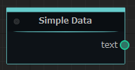
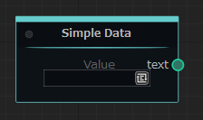
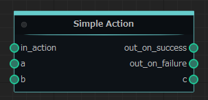

# Quickstart

## Running Server

Let's first figure out how to start the external node server.

A minimal server running script looks something like this:

```python
import mh_en_exec as mh

from nodes.foo_node import FooNode

try:
  mh.exec([FooNode])
except KeyboardInterrupt:
  pass
```

So what did that code do?

1. First we imported the Machine Heads External Node module {mod}`mh_en_exec <mh_en_exec>` as `mh`.
2. Next we imported custom node class called `FooNode`. For now, let's skip the details of creating the class, but if you want details see "[Creating node class](#creating-node-class)"
3. Then we use {func}`exec() <mh_en_exec.exec>` function to execute server and wait until ends. As an argument we send list of the node classes.
4. Also we trying to catch `KeyboardInterrupt` exception in order to be able stop external nodes execution by pressing `Ctrl+C`.

Now using this code we can run the external node server.

## Creating node class

Next, let's see how to create your own node.

First of all, need to decide the type of the node.<br>
Machine Heads have two type of nodes: {class}`action node <mh_en_exec.nodes.ActionNodeBase>` and {class}`data node <mh_en_exec.nodes.NodeBase>`.<br>
The difference is that an {class}`action node <mh_en_exec.nodes.ActionNodeBase>` provides some operation when executed, while a {class}`data node <mh_en_exec.nodes.NodeBase>` provides data that can be used on an {class}`action node <mh_en_exec.nodes.ActionNodeBase>`<br>
In terms of node structure, an {class}`action node <mh_en_exec.nodes.ActionNodeBase>` has built-in "*in_action*" input port and "*out_on_success*" and "*out_on_failure*" output ports, and a data node has no built-in ports.<br>

### Creating data node

First, let's create simple data node.

In order to do so, need to create class that will be inherited from {class}`NodeBase <mh_en_exec.nodes.NodeBase>`. It will be something like this.

```python
# import NodeBase class
from mh_en_exec.nodes import NodeBase

# create new node class
class SimpleDataNode(NodeBase):
  # set a display name
  NODE_NAME = 'Simple Data'
```

Next, need to add ports. For this `SimpleDataNode` class, let's create one string output port and name it as `text`.<br>
To do so need to import {class}`StringNodeOutput <mh_en_exec.nodes.ports.StringNodeOutput>`
```python
# import string output port
from mh_en_exec.nodes.ports import StringNodeOutput
```
And add new class variable called `text`, an instance of the {class}`StringNodeOutput <mh_en_exec.nodes.ports.StringNodeOutput>` class
```python
  # output port variable
  text = StringNodeOutput()
```

And, finally let's override {func}`perform <mh_en_exec.nodes.NodeBase.perform>` function to be able return some value on the node execution.

```python
  # node execution function
  def perform(self):
    return ('Hello World',)
```

In this case `SimpleDataNode` will give 'Hello World' string value through the `text` output port when executed.

Final class code will be like this:

```python
# import NodeBase class
from mh_en_exec.nodes import NodeBase
# import string output port
from mh_en_exec.nodes.ports import StringNodeOutput

# create new node class
class SimpleDataNode(NodeBase):
  # set a display name
  NODE_NAME = 'Simple Data'

  # output port variable
  text = StringNodeOutput()

  # node execution function
  def perform(self):
    return ('Hello World',)
```

On "Machine Heads" node will be look like this:



### Creating data node with view

In the previous example, we made the port value hardcoded, but it is possible to make the port value set from the "Machine Heads" user interface. To do so, you need to use a [port view](views.md).

Let's try adding a port view for the `text` port of our previous example class `SimpleDataNode`. To do this, need to add a new variable named `text_view`, an instance of the {class}`NodeStringView <mh_en_exec.nodes.views.NodeStringView>`, and link it to our `text` variable. To link, need to pass the name of the variable to which we want to link as the first argument of the {class}`NodeStringView <mh_en_exec.nodes.views.NodeStringView>` constructor.

But first, need to import {class}`NodeStringView <mh_en_exec.nodes.views.NodeStringView>` class.

```python
# import string port view
from mh_en_exec.nodes.views import NodeStringView
```

And only after that need to add our `text_view` variable.

```python
# output port variable
text = StringNodeOutput()

# output port view
text_view = NodeStringView('text')
```

After that, node will look like this:



Final code will be like this:

```python
# import NodeBase class
from mh_en_exec.nodes import NodeBase
# import string output port
from mh_en_exec.nodes.ports import StringNodeOutput
# import string port view
from mh_en_exec.nodes.views import NodeStringView


# create new node class
class SimpleDataNode(NodeBase):
  # set a display name
  NODE_NAME = 'Simple Data'

  # output port variable
  text = StringNodeOutput()

  # output port view
  text_view = NodeStringView('text')
```

```{eval-rst}
.. note::
  | The `perform` function has been removed since it is no longer necessary to return the port value through python code.
  | If the function `perform` is not in the node class, then when the node is executed, the value of the ports will be returned as is.
```

### Creating action node

Next, let's create simple action node.

This time we will try to make the node add up the value of the input ports.<br>
The formula for the operation will be as follows: `a + b = c`

As the last time, we start by creating a class, but this time we need to inherit {class}`ActionNodeBase <mh_en_exec.nodes.ActionNodeBase>` class.

```python
# import ActionNodeBase class
from mh_en_exec.nodes import ActionNodeBase

# create new node class
class SimpleActionNode(ActionNodeBase):
  # set a display name
  NODE_NAME = 'Simple Action'
```

Next, create ports. To do so, first, import {class}`IntegerNodeInput <mh_en_exec.nodes.ports.IntegerNodeInput>` and {class}`IntegerNodeOutput <mh_en_exec.nodes.ports.IntegerNodeOutput>`

```python
# import integer input port
from mh_en_exec.nodes.ports import IntegerNodeInput
# import integer output port
from mh_en_exec.nodes.ports import IntegerNodeOutput
```

and create input and output ports.

```python
  # input port variables
  a = IntegerNodeInput()
  b = IntegerNodeInput()

  # output port variable
  c = IntegerNodeOutput()
```

And as always need to override {func}`perform <mh_en_exec.nodes.NodeBase.perform>` function to make some operations, but this time we will receive input port values as arguments of the {func}`perform <mh_en_exec.nodes.NodeBase.perform>` function and return values will be not just tuple of output values, but also result of node execution.

```python
  # node execution function
  def perform(self, a, b):
    return True, (a + b,)
```

So final code will be like this:

```python
# import ActionNodeBase class
from mh_en_exec.nodes import ActionNodeBase
# import integer input port
from mh_en_exec.nodes.ports import IntegerNodeInput
# import integer output port
from mh_en_exec.nodes.ports import IntegerNodeOutput

# create new node class
class SimpleActionNode(ActionNodeBase):
  # set a display name
  NODE_NAME = 'Simple Action'

  # input port variables
  a = IntegerNodeInput()
  b = IntegerNodeInput()

  # output port variable
  c = IntegerNodeOutput()

  # node execution function
  def perform(self, a, b):
    return True, (a + b,)
```

On "Machine Heads" this action node will be look like this:




